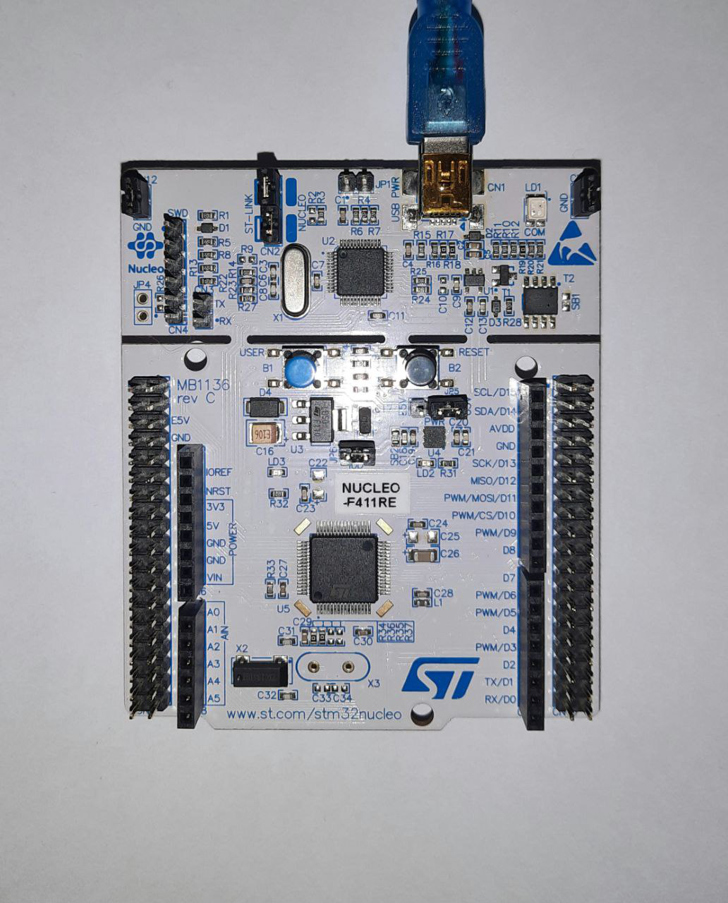

# Milestone 1: **STM32 Familiarization**

## Overview

The purpose of this milestone is for us to familiarize with STM32 firmware development and learn on verification of the STM32 board by creating and running Blinky program which blinks the LED at 1Hz. And by the end, we also able to learn on reporting using Github and the use of markdown code as we completed this milestone. In short, for this milestone, we installed the STM32Cube IDE, connected the board to our PC using USB cable, created the Blinky program then developed it onto our board.

We used the STM32 Nucleo-64 for this project in which the device is based on high-performance Arm® Cortex® -M4 32-bit RISC core operating at a frequency of up to 100 MHz. It incorporates high-speed embedded memories which is up to 512 Kbytes of Flash memory and 128 Kbytes of SRAM. The STM32 Nucleo-64 board does not require any separate probe as it integrates the ST-LINK/V2-1 debugger/programmer.
 
## Photo of the board

## Video links

Link for our milestone 1 demo:
[Milestone 1 - Group 1](https://youtu.be/9Ev4N6TqbdA)

Link for the STM32 with Blinky tutorial:
[Tutorial](https://youtu.be/hyZS2p1tW-g)

## Source code

The source is generated in C language: [Source code](main.c)

_We added two lines to the code generated by the STM32 IDE tool. The first line is to toggle the Port A, Pin 5 which is connected to the green LED, LD2 of the nucleo board and the other line is to set the delay to 1000 ms._

## References

1. https://www.digikey.com/en/maker/videos/shawn-hymel/getting-started-with-stm32-and-nucleo-part-1-introduction-to-stm32cubeide-and-blinky
2. https://www.st.com/en/embedded-software/stm32cube-mcu-mpu-packages.html
